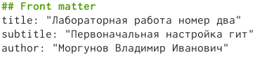
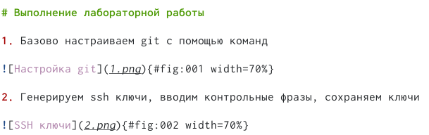
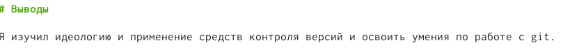

---
## Front matter
lang: ru-RU
title: Структура научной презентации
subtitle: Простейший шаблон
author:
  - Моргунов В. И.
institute:
  - Российский университет дружбы народов, Москва, Россия

## i18n babel
babel-lang: russian
babel-otherlangs: english

## Formatting pdf
toc: false
toc-title: Содержание
slide_level: 2
aspectratio: 169
section-titles: true
theme: metropolis
header-includes:
 - \metroset{progressbar=frametitle,sectionpage=progressbar,numbering=fraction}
 - '\makeatletter'
 - '\makeatother'
---

# Информация

## Докладчик

:::::::::::::: {.columns align=center}
::: {.column width="70%"}

  * Моргунов Владимир Иванович
  * студент 
  * НММбд-02-22
  * Российский университет дружбы народов
  * <https://godbyy.github.io/ru/>

:::
::: {.column width="30%"}

:::
::::::::::::::

# Вводная часть

## Актуальность

- Уметь делать отчёт по лабораторной работе очень важно т.к. без него студент теряет чуть ли не 30% возможных бaллов

## Объект и предмет исследования

- Способ создания отчёта в markdown
- Создание отчёта в pdf и word

## Цели и задачи

- Научиться делать отчёт в 3-х форматах

## Материалы и методы

- В качестве материала используем прошлую лабораторную работу
- Результирующие форматы
	- `pdf`
	- `md`
	- `word`
- Автоматизация процесса создания: `Makefile`

# Создание отчёта

## Делаем титульный лист отчёта

- Пишем название лабораторной работы
- Пишем тему лабораторной работы
- Пишем своё имя

## Делаем основную часть по данному нам пресету

- Описываем скрин
- Подписываем скрин
- Нумеруем скрин
- Задаём его расположение

::: {.column width="30%"}

## Создаём заключение

- Пишем вывод на основе цели
- Упоминаем в выводе то, чему научились

::: {.column width="30%"}

# Результаты

## Получающиеся форматы

- Полученный `pdf`-файл можно демонстрировать в любой программе просмотра `pdf`
- Полученный `word`-файл можно демонстрировать в любой программе просмотра `word`

## Результаты

- Я научился использовать markdown для создания отчёта

## Итоговый слайд

- Запоминается последняя фраза. © Штирлиц

:::

