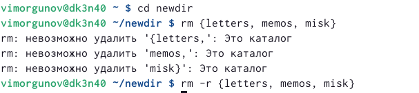

---
## Front matter
lang: ru-RU
title: Лабораторная работа №4
subtitle: Основы интерфейса взаимодействия пользователя с системой Unix на уровне командной строки
author:
  - Моргунов В. И.
institute:
  - Российский университет дружбы народов, Москва, Россия
 

## i18n babel
babel-lang: russian
babel-otherlangs: english

## Formatting pdf
toc: false
toc-title: Содержание
slide_level: 2
aspectratio: 169
section-titles: true
theme: metropolis
header-includes:
 - \metroset{progressbar=frametitle,sectionpage=progressbar,numbering=fraction}
 - '\makeatletter'
 - '\beamer@ignorenonframefalse'
 - '\makeatother'
---

# Информация

## Докладчик

:::::::::::::: {.columns align=center}
::: {.column width="70%"}

  * Моргунов Владимир Иванович
  * Российский университет дружбы народов
  * <https://godbyy.github.io/ru/>

:::
::: {.column width="30%"}

:::
::::::::::::::

# Цель работы

Познакомиться с командной строкой.

# Задание

Приобретение практических навыков взаимодействия пользователя с системой посредством командной строки.

# Выполнение лабораторной работы

## Перейдем в каталог tmp и выполним в нем команду ls с различными операциями. Используя -а увидим скрытые файлы, используя -alf увидим развернутое описание файлов 

{ #fig:001 width=70% }

## Перейдем в выше стоящую директорию, выведем каталоги из директории, заметим что файла cron нет .

{ #fig:002 width=70% }

## Перейдем в домашний каталог и путем поднятия по директориям узнаем владельца.

{ #fig:003 width=70% }

## Создадим новый каталог.

{ #fig:004 width=70% }

## Командой mkdir {letters, memos, misk} создадим новые каталоги.

![создание каталогов одной командой] (image/5.png){ #fig:005 width=70% }

## Затем добавив к команде -rm -r и удалим все каталоги, без -r мы бы не смогли удалить не пустые каталоги.

{ #fig:006 width=70% }

## Команда ls -R выводит все содержимое каталога и подкаталогов.

{ #fig:009 width=70% }

## Команда ls -ltr выведет файлы упорядочено, в зависимости от того, когда они изменялись.

{ #fig:011 width=70% }

## Далее c помощью команды man выведем несколько команд.
cd-отвечает за переходы между каталогами
pwd-вывод нахождения на данный момент
mkdir-создание каталогов
rmdir-удаление пустых каталогов
rm-удаление файлов и директорий

## C помощью команды history изменим команду.

{ #fig:013 width=70% }

## Контрольные вопросы

1. Что такое командная строка? Термина для работы с файлами, каталогами.
2. При помощи какой команды можно определить абсолютный путь текущего каталога?  pwd
3. При помощи какой команды и каких опций можно определить только тип файлов и их имена в текущем каталоге? Приведите примеры. ls -l
4. Каким образом отобразить информацию о скрытых файлах? Приведите примеры. ls -a
5. При помощи каких команд можно удалить файл и каталог? Можно ли это сделать одной и той же командой? Приведите примеры. rm/rmdir рм не удалит не пустой каталог.
6. Каким образом можно вывести информацию о последних выполненных пользователем командах? работы? history
7. Как воспользоваться историей команд для их модифицированного выполнения? Приведите примеры. !<номер команды>:s/чтоменяем/начтоменяем
8. Приведите примеры запуска нескольких команд в одной строке.
9. Дайте определение и приведите примера символов экранирования. символы замены стандартных слов ~=home
10. Охарактеризуйте вывод информации на экран после выполнения команды ls с опцией l. Вывод расширенной информации о файле-вес, название, защита.
11. Что такое относительный путь к файлу? Приведите примеры использования относительного и абсолютного пути при выполнении какой-либо команды.
12. Как получить информацию об интересующей вас команде? man
13. Какая клавиша или комбинация клавиш служит для автоматического дополнения вводимых команд? Ctrl+R

# Выводы

В данной лабораторной работе мы познакомились с командной строкой, научились простейшим командам.

:::

