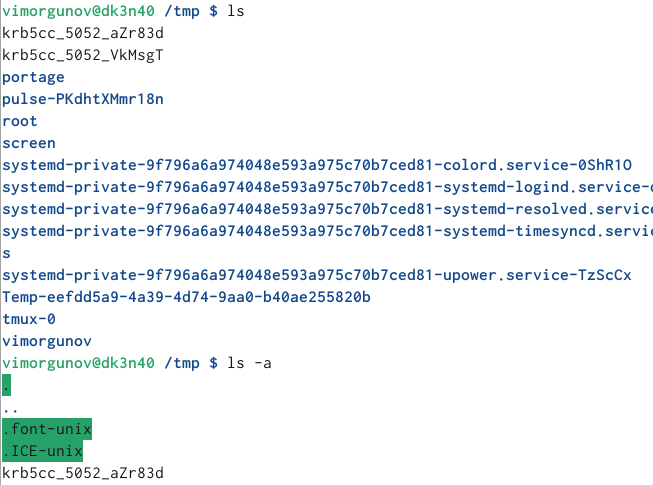
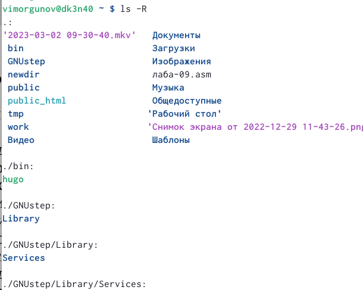
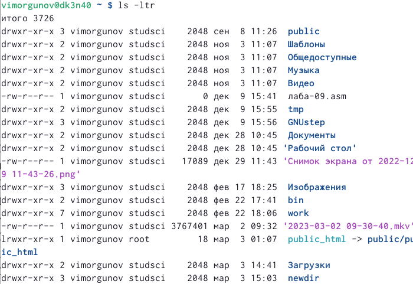

---
## Front matter
title: "Лаборная работа №4"
subtitle: "НММ-бд-02-22"
author: "Моргунов Владимир Иванович"

## Generic otions
lang: ru-RU
toc-title: "Содержание"

## Bibliography
bibliography: bib/cite.bib
csl: pandoc/csl/gost-r-7-0-5-2008-numeric.csl

## Pdf output format
toc: true # Table of contents
toc-depth: 2
fontsize: 12pt
linestretch: 1.5
papersize: a4
documentclass: scrreprt
## I18n polyglossia
polyglossia-lang:
  name: russian
  options:
	- spelling=modern
	- babelshorthands=true
polyglossia-otherlangs:
  name: english
## I18n babel
babel-lang: russian
babel-otherlangs: english
## Fonts
mainfont: PT Serif
romanfont: PT Serif
sansfont: PT Sans
monofont: PT Mono
mainfontoptions: Ligatures=TeX
romanfontoptions: Ligatures=TeX
sansfontoptions: Ligatures=TeX,Scale=MatchLowercase
monofontoptions: Scale=MatchLowercase,Scale=0.9
## Biblatex
biblatex: false
biblio-style: "gost-numeric"
biblatexoptions:
  - parentracker=true
  - backend=biber
  - hyperref=auto
  - language=auto
  - autolang=other*
  - citestyle=gost-numeric
## Pandoc-crossref LaTeX customization
figureTitle: "Рис."
tableTitle: "Таблица"
listingTitle: "Листинг"
lofTitle: "Список иллюстраций"
lotTitle: "Список таблиц"
lolTitle: "Листинги"
## Misc options
indent: true
header-includes:
  - \usepackage{indentfirst}
  - \usepackage{float} # keep figures where there are in the text
  - \floatplacement{figure}{H} # keep figures where there are in the text
---

# Цель работы

Познакомиться с командной строкой.

# Задание

Приобретение практических навыков взаимодействия пользователя с системой посредством командной строки.

# Выполнение лабораторной работы

1. Перейдем в каталог tmp и выполним в нем команду ls с различными операциями. Используя -а увидим скрытые файлы, используя -alf увидим развернутое описание файлов 

{ #fig:001 width=70% }

2. Перейдем в выше стоящую директорию, выведем каталоги из директории, заметим что файла cron нет .

{ #fig:002 width=70% }

3. Перейдем в домашний каталог и путем поднятия по директориям узнаем владельца.

{ #fig:003 width=70% }

4. Создадим новый каталог.

{ #fig:004 width=70% }

5. Командой mkdir {letters, memos, misk} создадим новые каталоги.

![создание каталогов одной командой] (image/5.png){ #fig:005 width=70% }

6. Затем добавив к команде -rm -r и удалим все каталоги, без -r мы бы не смогли удалить не пустые каталоги.

{ #fig:006 width=70% }

7. Команда ls -R выводит все содержимое каталога и подкаталогов.

{ #fig:009 width=70% }

8. Команда ls -ltr выведет файлы упорядочено, в зависимости от того, когда они изменялись.

{ #fig:011 width=70% }

9. Далее c помощью команды man выведем несколько команд.
cd-отвечает за переходы между каталогами
pwd-вывод нахождения на данный момент
mkdir-создание каталогов
rmdir-удаление пустых каталогов
rm-удаление файлов и директорий

10. C помощью команды history изменим команду.

{ #fig:013 width=70% }

# Контрольные вопросы

1. Что такое командная строка? Термина для работы с файлами, каталогами.
2. При помощи какой команды можно определить абсолютный путь текущего каталога?  pwd
3. При помощи какой команды и каких опций можно определить только тип файлов и их имена в текущем каталоге? Приведите примеры. ls -l
4. Каким образом отобразить информацию о скрытых файлах? Приведите примеры. ls -a
5. При помощи каких команд можно удалить файл и каталог? Можно ли это сделать одной и той же командой? Приведите примеры. rm/rmdir рм не удалит не пустой каталог.
6. Каким образом можно вывести информацию о последних выполненных пользователем командах? работы? history
7. Как воспользоваться историей команд для их модифицированного выполнения? Приведите примеры. !<номер команды>:s/чтоменяем/начтоменяем
8. Приведите примеры запуска нескольких команд в одной строке.
9. Дайте определение и приведите примера символов экранирования. символы замены стандартных слов ~=home
10. Охарактеризуйте вывод информации на экран после выполнения команды ls с опцией
l. Вывод расширенной информации о файле-вес, название, защита.
11. Что такое относительный путь к файлу? Приведите примеры использования относительного и абсолютного пути при выполнении какой-либо команды.
12. Как получить информацию об интересующей вас команде? man
13. Какая клавиша или комбинация клавиш служит для автоматического дополнения вводимых команд? Ctrl+R
# Выводы

В данной лабораторной работе мы познакомились с командной строкой, научились простейшим командам.

:::
