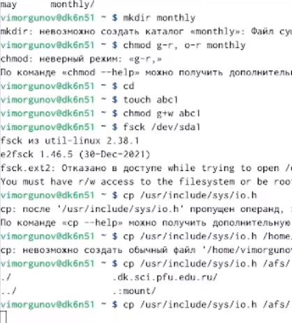
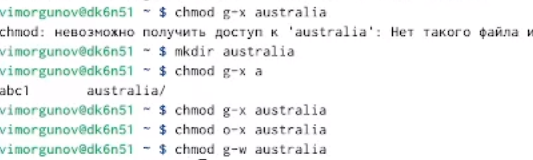

---
## Front matter
lang: ru-RU
title: Лабораторная работа №5
subtitle: Анализ файловой системы Linux. Команды для работы с файлами и каталогами
author:
  - Моргунов В. И.
institute:
  - Российский университет дружбы народов, Москва, Россия

## i18n babel
babel-lang: russian
babel-otherlangs: english

## Formatting pdf
toc: false
toc-title: Содержание
slide_level: 2
aspectratio: 169
section-titles: true
theme: metropolis
header-includes:
 - \metroset{progressbar=frametitle,sectionpage=progressbar,numbering=fraction}
 - '\makeatletter'
 - '\beamer@ignorenonframefalse'
 - '\makeatother'
---

# Информация

## Докладчик

:::::::::::::: {.columns align=center}
::: {.column width="70%"}

  * Моргунов Владимир Иванович
  * Российский университет дружбы народов
  * <https://godbyy.github.io/ru/>

:::
::: {.column width="30%"}

:::
::::::::::::::

# Цель работы

Ознакомление с файловой системой Linux, её структурой, именами и содержанием каталогов. Приобретение практических навыков по применению команд для работы с файлами и каталогами, по управлению процессами (и работами), по проверке исполь- зования диска и обслуживанию файловой системы.

# Выполнение лабораторной работы

## Выполним все примеры, приведённые в первой части описания лабораторной работы.

{ #fig:001 width=70% }
{ #fig:002 width=70% }
{ #fig:003 width=70% }
{ #fig:004 width=70% }
{ #fig:005 width=70% }

## Скопируем файл /usr/include/sys/io.h в домашний каталог и назовём его equipment. Если файла io.h нет, то используем любой другой файл в каталоге /usr/include/sys/ вместо него

{ #fig:006 width=70% }

## В домашнем каталоге создадим директорию ~/ski.plases. Переместим файл equipment в каталог ~/ski.plases.

{ #fig:007 width=70% }

## Переименуем файл ~/ski.plases/equipment в ~/ski.plases/equiplist.

{ #fig:008 width=70% }

## Создадим в домашнем каталоге файл abc1 и скопируем его в каталог ~/ski.plases, назовём его equiplist2. Создадим каталог с именем equipment в каталоге ~/ski.plases. Переместим файлы ~/ski.plases/equiplist и equiplist2 в каталог ~/ski.plases/equipment. 

{ #fig:009 width=70% }

## Создадим и переместим каталог ~/newdir в каталог ~/ski.plases и назовём его plans

{ #fig:010 width=70% }

## Определите опции команды chmod, необходимые для того, чтобы присвоить перечисленным ниже файлам выделенные права доступа

{ #fig:011 width=70% }

## Скопируем файл ~/feathers в файл ~/file.old. Переместим файл ~/file.old в каталог ~/play. Скопируем каталог ~/play в каталог ~/fun. Переместим каталог ~/fun в каталог ~/play и назовим его games. Лишим владельца файла ~/feathers права на чтение. Дадим владельцу файла ~/feathers право на чтение. Лишим владельца каталога ~/play права на выполнение. Дадим владельцу каталога ~/play право на выполнение.

{ #fig:012 width=70% }

# Выводы

Я ебло 

:::

