---
## Front matter
lang: ru-RU
title: Отчёт по лабораторной работе №6
subtitle: Поиск файлов. Перенаправление ввода-вывода. Просмотр запущенных процессов
author:
  - Моргунов В. И.
institute:
  - Российский университет дружбы народов, Москва, Россия

## i18n babel
babel-lang: russian
babel-otherlangs: english

## Formatting pdf
toc: false
toc-title: Содержание
slide_level: 2
aspectratio: 169
section-titles: true
theme: metropolis
header-includes:
 - \metroset{progressbar=frametitle,sectionpage=progressbar,numbering=fraction}
 - '\makeatletter'
 - '\beamer@ignorenonframefalse'
 - '\makeatother'
---

# Информация

## Докладчик

:::::::::::::: {.columns align=center}
::: {.column width="70%"}

  * Моргунов Владимир Иванович
  * Российский университет дружбы народов
  * <https://godbyy.github.io/ru/>

:::
::: {.column width="30%"}

:::
::::::::::::::

# Цель работы

Ознакомиться с инструментами поиска файлов и фильтрации текстовых данных. Приобрести практические навыки по управлению процессами (и заданиями), по проверке использования диска и обслуживанию файловых систем.

# Задание

- Выполнить все примеры, приведённые в первой части описания лабораторной работы
- Выполните действия, зафиксировав в отчёте по лабораторной работе используемые при этом команды и результаты их выполнения
- Создать отчёт и презентацию в Markdown
- Загрузить скринкасты на видео хостинг
- Представить работу на сайте ТУИС

# Выполнение лабораторной работы

##
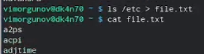

##

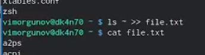

##

##

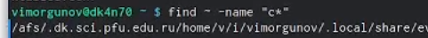

##

##

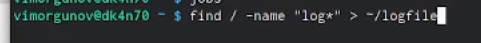

##

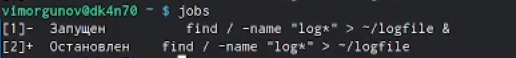

##

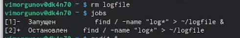

##

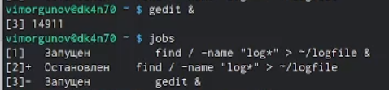

##

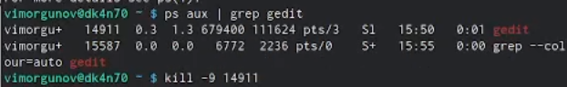

##

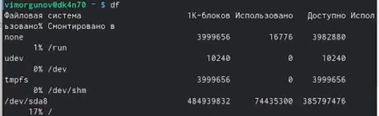

##

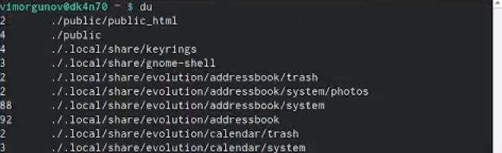

##

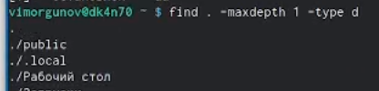

С помощью type d мы попросили команду find искать только каталоги.
С помощью maxdepth 1 мы попросили команду find сохранить поиск только на текущем уровне (и не заходить в подкаталоги).
Введёная команда также показывает скрытые каталоги.

# Контрольные вопросы

1. В системе по умолчанию открыто три специальных потока:
– stdin — стандартный поток ввода (по умолчанию: клавиатура), файловый дескриптор 0
– stdout — стандартный поток вывода (по умолчанию: консоль), файловый дескриптор 1
– stderr — стандартный поток вывод сообщений об ошибках (по умолчанию: консоль), файловый дескриптор 2
2. Операция > создаёт операция >> дополняет
3. Конвейер (pipe) служит для объединения простых команд или утилит в цепочки, в которых результат работы предыдущей команды передаётся последующей.
4. Компьютерная программа сама по себе — лишь пассивная последовательность инструкций. В то время как процесс — непосредственное выполнение этих инструкций
5. PID - идентификатор процесса, уникальный номер процесса в многозадачной операционной системе. GID - идентификатор группы
6. Запущенные фоном программы называются задачами (jobs). Ими можно управлять с помощью команды jobs, которая выводит список запущенных в данный момент задач
7. Top (table of processes) — консольная команда, которая выводит список работающих в системе процессов и информацию о них. Htop – хорошо известная утилита для мониторинга, аналог top
8. Команда find используется для поиска и отображения на экран имён файлов, соответствующих заданной строке символов. Формат команды: find (путь) (опции)
Пример:
Вывести на экран имена файлов из вашего домашнего каталога и его подкаталогов, начинающихся на f: find ~ -name "f*" -print
9. Файл можно найти по контексту. Показать строки во всех файлах, в которых есть слово begin: grep begin
10. Определить объем свободной памяти на жёстком диске можно с помощью команды df
11. Команда du показывает число килобайт, используемое каждым файлом или каталогом. Чтобы найти объём домашнего каталога надо ввести команду du ~ в терминал
12. Зависший процесс можно завершить с помощью команды kill, указав опцию -9 и номер процесса

# Выводы

Ознакомились с инструментами поиска файлов и фильтрации текстовых данных. Приобрели практические навыки по управлению процессами (и заданиями), по проверке использования диска и обслуживанию файловых систем.

