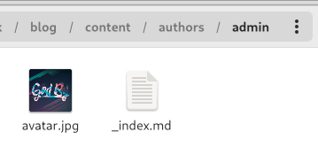
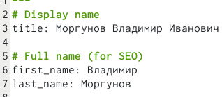
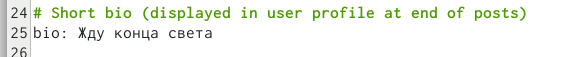
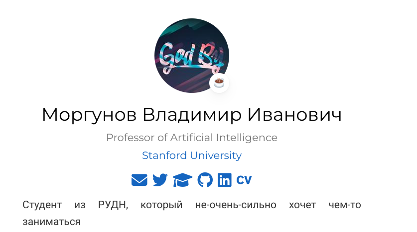
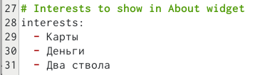
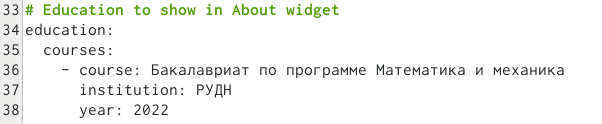
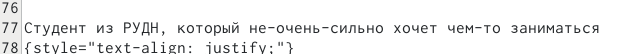
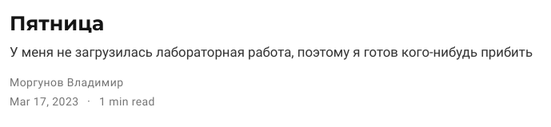
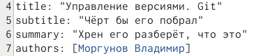
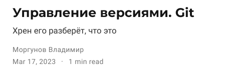

---
## Front matter
lang: ru-RU
title: Выполнение 2 этапа проекта
subtitle: Операционные системы
author:
  - Моргунов В. И.
institute:
  - Российский университет дружбы народов, Москва, Россия

## i18n babel
babel-lang: russian
babel-otherlangs: english

## Formatting pdf
toc: false
toc-title: Содержание
slide_level: 2
aspectratio: 169
section-titles: true
theme: metropolis
header-includes:
 - \metroset{progressbar=frametitle,sectionpage=progressbar,numbering=fraction}
 - '\makeatletter'
 - '\beamer@ignorenonframefalse'
 - '\makeatother'
---

# Информация

## Докладчик

:::::::::::::: {.columns align=center}
::: {.column width="70%"}

  * Моргунов Владимир Иванович
  * студент 
  * НММбд-02-22
  * Российский университет дружбы народов
  * <https://godbyy.github.io/ru/>

:::
::: {.column width="30%"}

:::
::::::::::::::

# Цель работы

Целью работы является освоение новых команд терминала, связанных с конструктором статических веб-сайтов Hugo, приобретение практических навыков изменения информации о владельце сайта и добавления новых постов, а также более детальное изучение файлов директории blog персонального проекта.

# Задание

Добавить к сайту данные о себе. Разместить фотографию владельца сайта. Разместить краткое описание владельца сайта (Biography). Добавить информацию об интересах (Interests). Добавить информацию об образовании (Education). Создать два поста: о пятнице и git.

# Выполнение лабораторной работы

##

##

##

##

##

##

##

##

##

##

##

##

# Выводы

Освоили новые команды терминала, связанные с конструктором статических веб-сайтов Hugo, приобрели практические навыки изменения информации о владельце сайта и добавления новых постов, а также лучше познакомились с файлами в директории blog персонального проекта.
